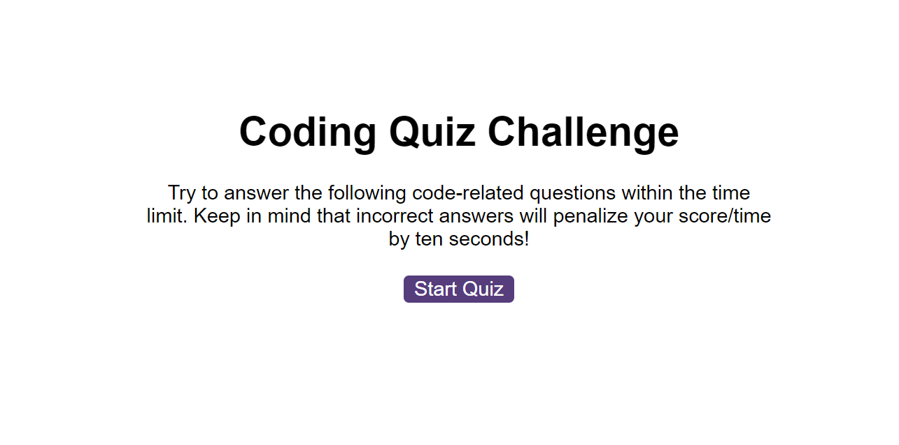

# quiz-app

> A quiz app that has a countdown timer when the game is started. Keeps track of the users score and decreases the remaining time for incorrect answers. The ability to save the users high score at the end of the quiz.

## Table of contents

- [General info](#general-info)
- [Screenshots](#screenshots)
- [Technologies](#technologies)
- [Setup](#setup)
- [Live Application](#live-application)
- [Features](#features)
- [Status](#status)
- [Contact](#contact)

## General info

Made to practise functions, setting and accessing local storage and setting intervals.

## Screenshots

## Technologies

- HTML
- CSS
- JavaScript

## Setup

- Open the index.html in any modern browser
- Click the 'Start Quiz' button to begin.

## Live Application

https://sbillsborough.github.io/quiz-app/

## Features

- Button to start the quiz
- Keeps track of user score
- Decreases time by 10 seconds for incorrect answers
- Can save users initials and score
- Button to clear high scores

## Status

Project is: _finished_

## Contact

Created by [billsboroughscott@gmail.com] - feel free to contact me!
